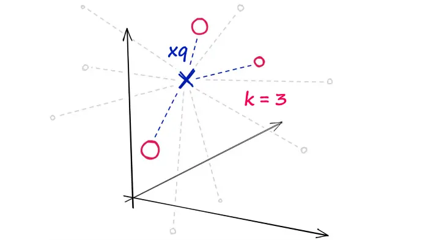

# Flat

## Introduction



不对数据进行任何修改

- 没有近似
- 没有聚类

**完美的搜索质量，显著的搜索时间**。

## Implementation

```python
import shutil
import urllib.request as request
from contextlib import closing

# first we download the Sift1M dataset
with closing(request.urlopen('ftp://ftp.irisa.fr/local/texmex/corpus/sift.tar.gz')) as r:
    with open('sift.tar.gz', 'wb') as f:
        shutil.copyfileobj(r, f)
```

```python
import tarfile

# the download leaves us with a tar.gz file, we unzip it
tar = tarfile.open('sift.tar.gz', "r:gz")
tar.extractall()
```

```python
import numpy as np

# now define a function to read the fvecs file format of Sift1M dataset
def read_fvecs(fp):
    a = np.fromfile(fp, dtype='int32')
    d = a[0]
    return a.reshape(-1, d + 1)[:, 1:].copy().view('float32')
```

```python
# data we will search through
xb = read_fvecs('sift_base.fvecs')  # 1M samples
# also get some query vectors to search with
xq = read_fvecs('./sift/sift_query.fvecs')
# take just one query (there are many in sift_learn.fvecs)
xq = xq[0].reshape(1, xq.shape[1])
```

```python
xq.shape
```

```admonish success title=''
    (1, 128)
```

```python
xb.shape
```

```admonish success title=''
    (1000000, 128)
```

```python
xq
```

```admonish success title=''
    array([[  1.,   3.,  11., 110.,  62.,  22.,   4.,   0.,  43.,  21.,  22.,
            18.,   6.,  28.,  64.,   9.,  11.,   1.,   0.,   0.,   1.,  40.,
            101.,  21.,  20.,   2.,   4.,   2.,   2.,   9.,  18.,  35.,   1.,
            1.,   7.,  25., 108., 116.,  63.,   2.,   0.,   0.,  11.,  74.,
            40., 101., 116.,   3.,  33.,   1.,   1.,  11.,  14.,  18., 116.,
            116.,  68.,  12.,   5.,   4.,   2.,   2.,   9., 102.,  17.,   3.,
            10.,  18.,   8.,  15.,  67.,  63.,  15.,   0.,  14., 116.,  80.,
            0.,   2.,  22.,  96.,  37.,  28.,  88.,  43.,   1.,   4.,  18.,
            116.,  51.,   5.,  11.,  32.,  14.,   8.,  23.,  44.,  17.,  12.,
            9.,   0.,   0.,  19.,  37.,  85.,  18.,  16., 104.,  22.,   6.,
            2.,  26.,  12.,  58.,  67.,  82.,  25.,  12.,   2.,   2.,  25.,
            18.,   8.,   2.,  19.,  42.,  48.,  11.]], dtype=float32)
```

Flat 索引无需训练，直接搜索。

```python
d = 128  # dimensionality of Sift1M data
k = 10  # number of nearest neighbors to return

index = faiss.IndexFlatIP(d)
index.add(data)
D, I = index.search(xq, k)
```

Flat 索引非常准确，但是速度非常慢，在相似搜索中，搜索速度和搜索质量间总是存在着权衡。

- 减小搜索范围（Coarse quantizer）：
  - [IVF](./IVF.md)
  - [HNSW](./HNSW.md)
- 减小向量大小（Fine quantizer）：
  - [PQ](./)

