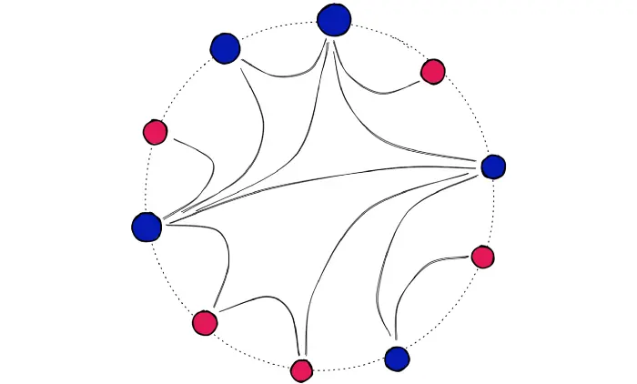
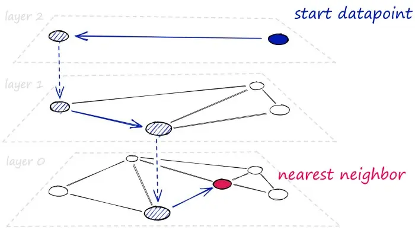

# Hierarchical Navigable Small World Graphs

<iframe width="560" height="315" src="https://www.youtube.com/embed/QvKMwLjdK-s?si=iHsk1vbQC2IopdL-" title="YouTube video player" frameborder="0" allow="accelerometer; autoplay; clipboard-write; encrypted-media; gyroscope; picture-in-picture; web-share" referrerpolicy="strict-origin-when-cross-origin" allowfullscreen></iframe>

## Introduction

> [!IMPORTANT]  
> HNSW是ANNS最佳索引之一。

> [!NOTE]  
> NSW 是一种所有顶点都与最近的一些邻居相连的图。

一张可视化的NSW图。（但是不清楚“所有顶点都与最近的一些邻居相连”如何理解）


HNSW将NSW分解成多层来构建，每个新增的层都消除了一些顶点到顶点的中间连接。



## Implementation

```python
# set HNSW index parameters
M = 64  # number of connections each vertex will have
ef_search = 32  # depth of layers explored during search
ef_construction = 64  # depth of layers explored during index construction

# initialize index (d == 128)
index = faiss.IndexHNSWFlat(d, M)
# set efConstruction and efSearch parameters
index.hnsw.efConstruction = ef_construction
index.hnsw.efSearch = ef_search
# add data to index
index.add(wb)

# search as usual
D, I = index.search(wb, k)
```

|   | M | efSearch | efConstruction |
|---|---|----------|----------------|
| 含义 | 每个顶点的连接数 | 搜索时队列的长度 | 构建时队列的长度 |
