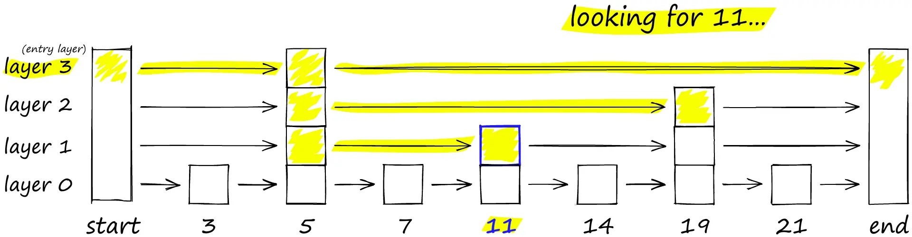
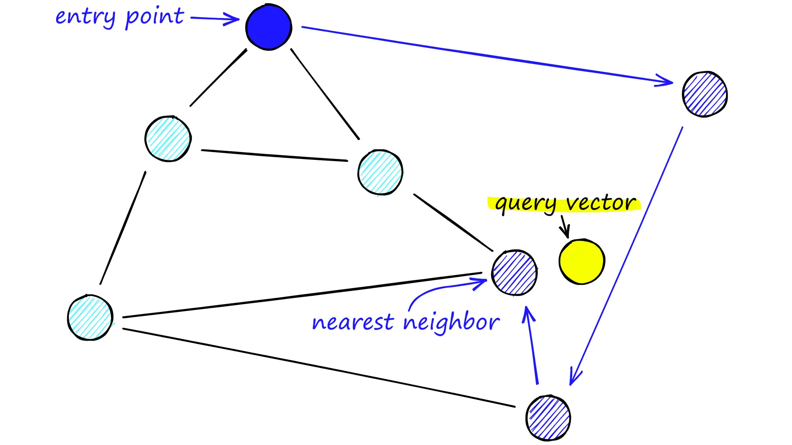
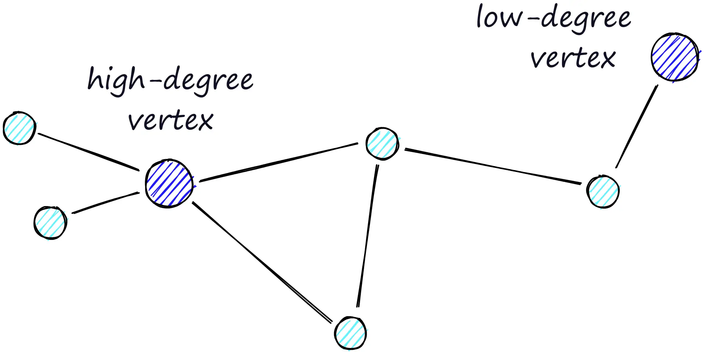

# Hierarchical Navigable Small World Graphs

<iframe width="560" height="315" src="https://www.youtube.com/embed/QvKMwLjdK-s?si=iHsk1vbQC2IopdL-" title="YouTube video player" frameborder="0" allow="accelerometer; autoplay; clipboard-write; encrypted-media; gyroscope; picture-in-picture; web-share" referrerpolicy="strict-origin-when-cross-origin" allowfullscreen></iframe>

## Introduction

> [!IMPORTANT]  
> HNSW是ANNS最佳索引之一。

> [!NOTE]  
> NSW 是一种所有顶点都与最近的一些邻居相连的图。

一张可视化的NSW图。（但是不清楚“所有顶点都与最近的一些邻居相连”如何理解）


HNSW将NSW分解成多层来构建，每个新增的层都消除了一些顶点到顶点的中间连接。


```admonish note title='Probability Skip List'
跳表能像排序数组一样快速进行搜索，同时也能使用链表结构快速插入新元素。

跳表的实现方式是构建多层次的链表，在第一层找到跳过很多中间节点的连接，随着向下移动层，每个链接跳过的节点会减少。

搜索时，从具有最长跳跃长度的最高层开始，沿着边朝右（下）方移动，如果下一跳的值大于我们要搜索的值，那么就向下移动一层再进行搜索。



HNSW 继承了相同的分层设计格式，高层的边较长（用于快速搜索），低层的边较短（用于准确搜索）。
```

```admonish note title='Navigable Small World Graphs'
可导航的小世界(NSW)图的向量搜索理念是：采用邻近图，但同时为其构建短距离和长距离连接，则搜索时间将缩短至（多/poly）对数/logarithmic复杂度。

在搜索NSW图时，我们从预定义的入口点开始，每次搜索时寻找最接近查询点的向量，并移动到该点。

最终，我们将找不到比当前顶点更接近查询点的点——这是一个局部最小值，作为结束查询的条件。



当一个具有大量节点的网络中存在图不可导航时，这种贪心搜搜的策略有效性大大降低。

路由（通过图的路线）由两阶段组成：

1. 首先是缩小（zoom-out）阶段，通过低度节点。
2. 然后是放大（zoom-in）阶段，通过高度节点。



因为缩小的条件是找不到下一跳的节点更接近查询点，所以我们在zoom-out阶段更有可能因为到达局部最小值而过早停止。

为了尽量减少提前结束搜索的概率（并提高召回率），我们可以增加节点的平均度数，但同时这会增加网络的复杂性（显著增加内存占用）和搜索时间。

另一个方法是从高度节点开始搜索（先zoom-in），这样确实能增加低维数据上的性能，这也是HNSW结构中一个重要因素。
```


## Implementation

```python
# set HNSW index parameters
M = 64  # number of connections each vertex will have
ef_search = 32  # depth of layers explored during search
ef_construction = 64  # depth of layers explored during index construction

# initialize index (d == 128)
index = faiss.IndexHNSWFlat(d, M)
# set efConstruction and efSearch parameters
index.hnsw.efConstruction = ef_construction
index.hnsw.efSearch = ef_search
# add data to index
index.add(wb)

# search as usual
D, I = index.search(wb, k)
```

|   | M | efSearch | efConstruction |
|---|---|----------|----------------|
| 含义 | 每个顶点的连接数 | 搜索时队列的长度 | 构建时队列的长度 |
