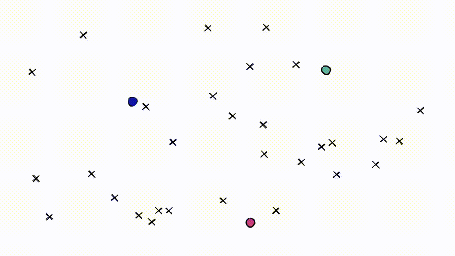
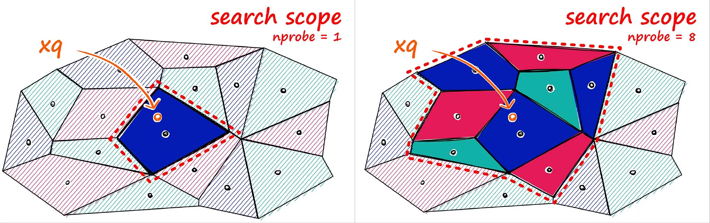

# Inverted File Index

## Introduction

IVF索引通过聚类来缩小搜索范围。它基于 Voronoi 图的概念，

> [!NOTE]
> Voronoi：想象将高维向量放入二维空间。然后在二维空间中放置一些额外的点，这些点将成为我们的“簇”质心，这些簇就是Voronoi。

从每个质心向外延伸相等的半径。在某个时刻，每个cell的圆周将与另一个cell相撞——形成边缘。每个数据点都包含在一个cell内，并分配给相应的质心。

查询向量xq也落在其中一个cell内，此时将搜索范围限制在该单个cell。

但是，如果查询向量落在cell的边缘附近，就会出现问题，很有可能其最近的数据点落在在相邻的cell。称之为 edge problem。

可以通过设置参数 `nprobe` 来设置需要搜索的cell的数量。

