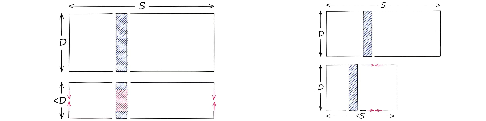
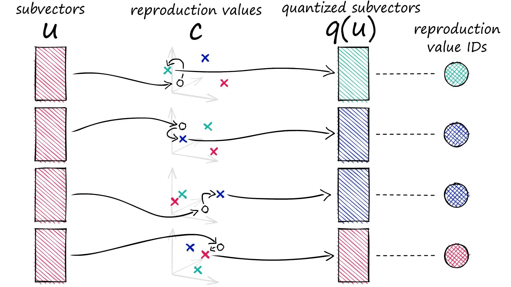

# Product Quantization

PQ并不是一种索引，而是创建复合索引中的一种Fine quantizer。

## Introduction

<iframe width="560" height="315" src="https://www.youtube.com/embed/t9mRf2S5vDI?si=-y4TyDmvil9q9cd5" title="YouTube video player" frameborder="0" allow="accelerometer; autoplay; clipboard-write; encrypted-media; gyroscope; picture-in-picture; web-share" referrerpolicy="strict-origin-when-cross-origin" allowfullscreen></iframe>

向量相似性搜索可能需要大量内存，随着数据集大小的不断增加，内存占用会变得难以承受。PQ可以大幅压缩高维向量，甚至能减少97%的内存占用。（But at what cost？）

### Quantization & Dimensionality-reduction

量化与降维不同，降维的目的是得到一个低维向量，而量化的目的是得到一个低精度向量。

> [!TIP]
> 比如我有一个128维的FP32向量，我可以将其降维到64维（不是简单的裁切，比如使用PCA主成分分析），也可以将其量化为INT8向量。毫无疑问这两种方法都减少了向量的占用，而且都损失了信息。
> 
> 降维缩小了向量的维度，量化缩小了能表示的范围。
> 但是PQ并不是简单的将每个维度的信息量化成更低精度的表示。粗略地说，PQ先将向量分成几个子向量，每个子向量用它们所在的簇的ID来表示。

### How PQ works

1. 我有一些128维的向量。
2. 按32维切分成4个子向量。
3. 对所有128维向量的相同位置上的32维子向量进行聚类，例如得到128个簇。
4. 用每个子向量所在簇的ID来表示这个子向量。（这样我们就能用2字节表示一个子向量）
5. 最终128维的向量可以用8字节表示。



**切分向量**
```python
x = [1, 8, 3, 9, 1, 2, 9, 4, 5, 4, 6, 2]

m = 4
D = len(x)
# ensure D is divisable by m
assert D % m == 0
# length of each subvector will be D / m (D* in notation)
D_ = int(D / m)

# now create the subvectors
u = [x[row:row+D_] for row in range(0, D, D_)]
print(u)
```
**创建聚类**
    为方便起见，这里随机生成聚类中心。
    再现值（reproduction values）：用\(c_{ji}\)表示第\(j\)个子向量的第\(i\)个所选质心。
```python
k = 2**5
assert k % m == 0
k_ = int(k/m)
print(f"{k=}, {k_=}")

from random import randint

c = []  # our overall list of reproduction values
for j in range(m):
    # each j represents a subvector (and therefore subquantizer) position
    c_j = []
    for i in range(k_):
        # each i represents a cluster/reproduction value position *inside* each subspace j
        c_ji = [randint(0, 9) for _ in range(D_)]
        c_j.append(c_ji)  # add cluster centroid to subspace list
    # add subspace list of centroids to overall list
    c.append(c_j)
```
    定义函数计算L2距离和寻找最近邻居
    `ids`记录距离每个子向量最近的质心的标识符。
```python
def euclidean(v, u):
    distance = sum((x - y) ** 2 for x, y in zip(v, u)) ** .5
    return distance

def nearest(c_j, u_j):
    distance = 9e9
    for i in range(k_):
        new_dist = euclidean(c_j[i], u_j)
        if new_dist < distance:
            nearest_idx = i
            distance = new_dist
    return nearest_idx

ids = []
for j in range(m):
    i = nearest(c[j], u[j])
    ids.append(i)
print(ids)
```
    q是用质心坐标表示的向量。
```python
q = []
for j in range(m):
    c_ji = c[j][ids[j]]
    q.extend(c_ji)

print(q)
```

~~~admonish example

假设：
```python
u = [[1, 8, 3], [9, 1, 2], [9, 4, 5], [4, 6, 2]]
```
我们有 `m=4` 个子空间，每个 `u[j]` 都有 `k_=8` 个可选的簇心 `c[j]`。

代码执行 `nearest(c[j], u[j])`，找到 `u[j]` 在 `c[j]` 里的最近簇心：
```python
ids = [7, 1, 5, 3]
```
这意味着：
- `u[0] = [1, 8, 3]` 在 `c[0]` 里最接近 `c[0][7]`
- `u[1] = [9, 1, 2]` 在 `c[1]` 里最接近 `c[1][1]`
- `u[2] = [9, 4, 5]` 在 `c[2]` 里最接近 `c[2][5]`
- `u[3] = [4, 6, 2]` 在 `c[3]` 里最接近 `c[3][3]`

然后 `q` 通过 `ids` 找到这些簇心，并拼接：
```python
q = []
for j in range(m):
    c_ji = c[j][ids[j]]  # 取出最近的簇心
    q.extend(c_ji)       # 展开并拼接
```
最终：
```python
q = c[0][7] + c[1][1] + c[2][5] + c[3][3]
```
~~~

~~~admonish success
```python
x = [1, 8, 3, 9, 1, 2, 9, 4, 5, 4, 6, 2]

m = 4
D = len(x)
# ensure D is divisable by m
assert D % m == 0
# length of each subvector will be D / m (D* in notation)
D_ = int(D / m)

# now create the subvectors
u = [x[row:row+D_] for row in range(0, D, D_)]
print(u)

k = 2**5
assert k % m == 0
k_ = int(k/m)
print(f"{k=}, {k_=}")

from random import randint

c = []  # our overall list of reproduction values
for j in range(m):
    # each j represents a subvector (and therefore subquantizer) position
    c_j = []
    for i in range(k_):
        # each i represents a cluster/reproduction value position *inside* each subspace j
        c_ji = [randint(0, 9) for _ in range(D_)]
        c_j.append(c_ji)  # add cluster centroid to subspace list
    # add subspace list of centroids to overall list
    c.append(c_j)
    
def euclidean(v, u):
    distance = sum((x - y) ** 2 for x, y in zip(v, u)) ** .5
    return distance

def nearest(c_j, u_j):
    distance = 9e9
    for i in range(k_):
        new_dist = euclidean(c_j[i], u_j)
        if new_dist < distance:
            nearest_idx = i
            distance = new_dist
    return nearest_idx

ids = []
for j in range(m):
    i = nearest(c[j], u[j])
    ids.append(i)
print(ids)

q = []
for j in range(m):
    c_ji = c[j][ids[j]]
    q.extend(c_ji)

print(q)
```
~~~

## Implementation in Faiss

<iframe width="560" height="315" src="https://www.youtube.com/embed/BMYBwbkbVec?si=jUPoNcsXxWUDcUja" title="YouTube video player" frameborder="0" allow="accelerometer; autoplay; clipboard-write; encrypted-media; gyroscope; picture-in-picture; web-share" referrerpolicy="strict-origin-when-cross-origin" allowfullscreen></iframe>

在开始之前，我们需要获取数据。我们将使用 Sift1M 数据集。

```python
import shutil
import urllib.request as request
from contextlib import closing

# first we download the Sift1M dataset
with closing(request.urlopen('ftp://ftp.irisa.fr/local/texmex/corpus/sift.tar.gz')) as r:
    with open('sift.tar.gz', 'wb') as f:
        shutil.copyfileobj(r, f)

import tarfile

# the download leaves us with a tar.gz file, we unzip it
tar = tarfile.open('sift.tar.gz', "r:gz")
tar.extractall()

import numpy as np

# now define a function to read the fvecs file format of Sift1M dataset
def read_fvecs(fp):
    a = np.fromfile(fp, dtype='int32')
    d = a[0]
    return a.reshape(-1, d + 1)[:, 1:].copy().view('float32')

# data we will search through
wb = read_fvecs('./sift/sift_base.fvecs')  # 1M samples
# also get some query vectors to search with
xq = read_fvecs('./sift/sift_query.fvecs')
# take just one query (there are many in sift_learn.fvecs)
xq = xq[0].reshape(1, xq.shape[1])

xq.shape # (1, 128)

wb.shape # (1000000, 128)
```

### IndexPQ

```python
import faiss

D = xb.shape[1]
m = 8
assert D % m == 0
nbits = 8  # number of bits per subquantizer, k* = 2**nbits
index = faiss.IndexPQ(D, m, nbits)
```

索引需要3个参数：
- `D`：向量的维度
- `m`：子向量的数量
- `nbits`：每个子向量的位数

> [!Tip]
> `nbits` 定义了每个子量化器可以使用的位数,例如 `nbits` 为 11，每个子空间有2048质心。

因为使用的是使用聚类的 PQ，所以必须预先训练我们的索引。（这里直接使用 `xb` 进行训练）,然后再将向量添加到索引中进行搜索

```python
index.is_trained # False
index.train(xb)  # PQ training can take some time when using large nbits
index.is_trained # True
index.add(xb)

dist, I = index.search(xq, k) # 在dist中返回距离，在I中返回索引。

%%timeit
index.search(xq, k) # 1.49 ms ± 49.1 µs per loop (mean ± std. dev. of 7 runs, 1000 loops each)
```

使用L2索引作为基准，计算召回率

```python
l2_index = faiss.IndexFlatL2(D)
l2_index.add(xb)

%%time
l2_dist, l2_I = l2_index.search(xq, k) # CPU times: user 46.1 ms, sys: 15.1 ms, total: 61.2 ms, Wall time: 15 ms

sum([1 for i in I[0] if i in l2_I]) # 50
```

搜索表现部分将放在[Comparison](../comparison.md)中讨论。

### IndexIVFPQ

为了进一步加快搜索时间，我们可以添加另一个步骤——使用 IVF 索引，它将减少搜索中比较的向量。

首先初始化IVFPQ索引：

```python
vecs = faiss.IndexFlatL2(D)

nlist = 2048  # how many Voronoi cells (must be >= k* which is 2**nbits)
nbits = 8  # when using IVF+PQ, higher nbits values are not supported
index = faiss.IndexIVFPQ(vecs, D, nlist, m, nbits)
```

训练，添加，搜索...

```python
index.train(xb)
index.add(xb)
dist, I = index.search(xq, k)
%%timeit
index.search(xq, k) # 86.3 µs ± 15 µs per loop (mean ± std. dev. of 7 runs, 10000 loops each)
sum([1 for i in I[0] if i in l2_I]) # 34
```

搜索速度从1.49ms降低到86.3µs，但是召回率从50%降低到34%。在给定等效参数的情况下，IndexPQ 和 IndexIVFPQ 都应该能够获得相同的召回率性能。

在这种情况下，提高召回率的办法是提高nprobe参数。（当nprobe=nlist时，IndexIVFPQ退化为IndexPQ）

| nprobe | 召回率 | 时延 |
|---|---|---|
| 1 | 34 | 86.3µs |
| 2 | 39 |  |
| 48 | 50 |  |
| 2048 | 50 | 1.49ms |

## Conclusion

|Index|高召回|低时延|低内存|
|---|---|---|---|
|Flat|🟢🟢🟢🟢🟢|🔴|🔴|
|PQ|🟡🟡🟡🟡|🟡🟡🟡|🟢🟢🟢🟢🟢|
|IVFPQ|🟡🟡🟡🟡|🟢🟢🟢🟢🟢|🟡🟡🟡🟡|
